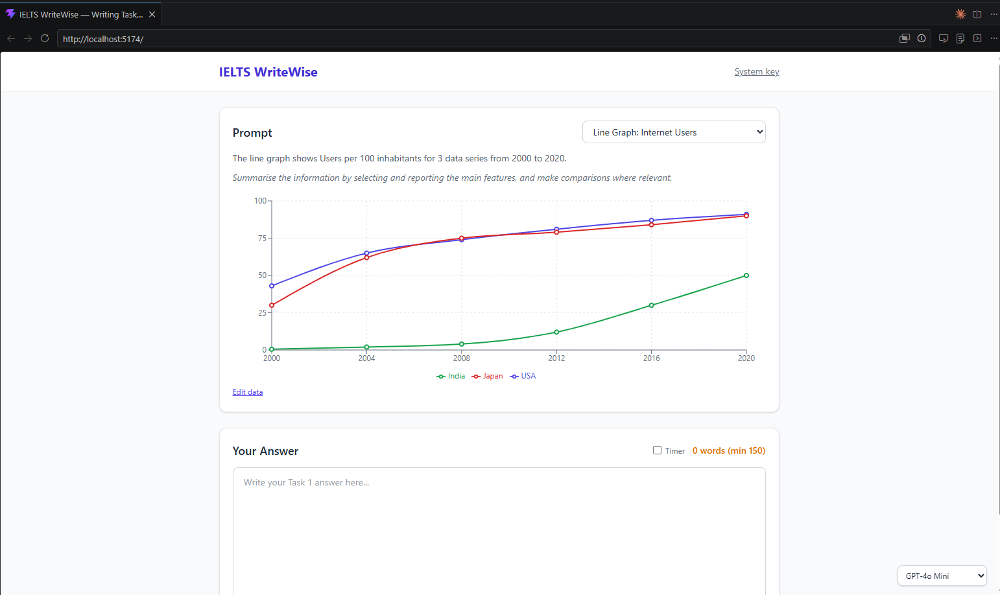

# IELTS WriteWise



AI-powered IELTS Writing Task 1 practice tool with rule-based scoring, detailed feedback in Vietnamese & English, and editable charts.

## Features

- **5 chart types**: Line graph, Bar chart, Pie chart, Table, Process diagram
- **Editable chart data**: Add/remove data points, series, or categories directly in the UI
- **AI scoring**: Submit answers to OpenRouter AI for band score evaluation across 4 criteria (TA, CC, LR, Grammar)
- **Rule-based feedback**: AI follows a comprehensive IELTS rulebook for consistent scoring
- **Bilingual feedback**: Issues and explanations in both English and Vietnamese
- **Dynamic descriptions**: Chart descriptions update automatically when data changes
- **20-min countdown timer**: Optional timer for exam simulation
- **Two API key modes**: System key (`.env`) or personal key (saved in browser)

## Getting Started

```bash
# Install dependencies
npm install

# Copy environment file and add your OpenRouter API key
cp .env.example .env
# Edit .env and set VITE_OPENROUTER_API_KEY=sk-or-v1-...

# Start dev server
npm run dev
```

## Build

```bash
npm run build
npm run preview
```

## Tech Stack

React 19, Vite 8, Tailwind CSS v4, Recharts
